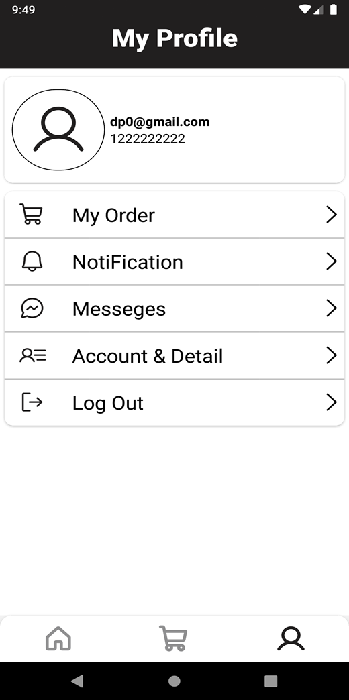

# The Furniture App
The Furniture App

Home Screen
Once you're logged in, you'll be greeted with the home screen, displaying various furniture products with their respective images and prices. You can easily search for a specific product using the search bar or filter products based on your preferences using the filter  button 

Product Detail Screen
Simply tap on a product to view its detail screen, where you'll find more information such as the price, image, discount price, and a description. You can also add the product to your cart or mark it as a favorite for easy access later.

Cart Screen
Access your cart from the bottom navigation bar to view all the items you've added. The cart screen is intelligently managed using Redux Persist, ensuring that your cart data is always up-to-date and accessible, even after closing the app.

Favorites Screen
The favorites screen can be accessed from the product detail screen. Simply tap the favorite button to add the item to your favorites list.

Checkout and Payment
Navigate to the checkout screen from the cart screen to input your delivery address and proceed to payment using Razor Pay. Once your payment is successful, you'll be redirected to the order screen, where you can view your order details and expected delivery time.

Settings Screen
In the settings screen, you can view and edit your profile picture, name, and mobile number. Additionally, we've implemented a chatbot AI to assist you with any questions or concerns you may have.

We hope you enjoy using Furniture App! If you have any feedback or suggestions, please don't hesitate to reach out to us. Happy shopping!

